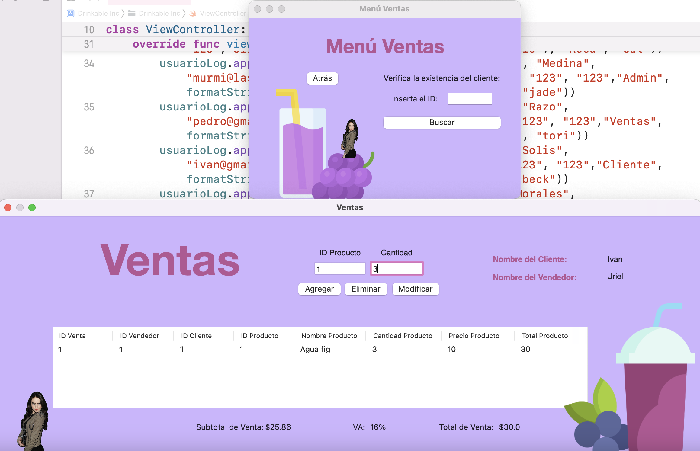

# Drinkable Inc.
CRUD de tienda de bebidas
Proyecto realizado en equipo. 

Lista de módulos y entidades: 

CRUD usuarios  

CRUD productos

CRUD Compras  

CRUD Ventas  

CRUD Pedidos  

Usuarios: 

Administrador(todo)  

Vendedores(ventas)  

Compradores (productos, inventario)  

Clientes(pedidos)  

### Capturas de pantalla:

